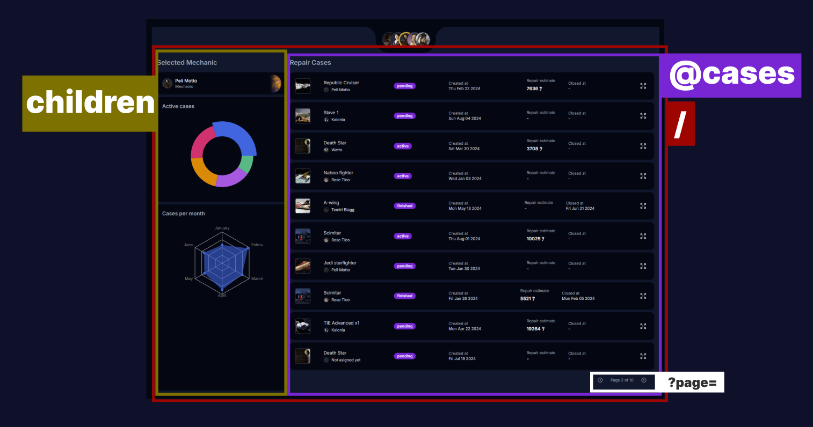

# ShipDepot (Tech Test)
This project serves as a tech test.

Is a fictional CRM for an hypothetical Star Wars spaceship repair company. Is intented to be a simple CRM with a login page and a dashboard with a list of cases and mechanics assigned to them. The user can see the details of the case and the mechanic assigned to it. The user can also assign a mechanic to a case. The dashboard also has metrics about the cases.

- The project is made with the latest version of [`NextJS`](https://nextjs.org/).
- Uses [`motion`](https://motion.dev/) for basic animations.
- Is tested with [`Jest`](https://jestjs.io/) and [`React Testing Library`](https://testing-library.com/docs/react-testing-library/intro/).

## Project Structure
The project uses the NextJS app router. The project is divided into domains. Each domain has its own folder in the `app` directory. Its a new approach that im interested in trying out.

## Dashboard rendering strategy

As you can see in the image the "/" page, which is the dashboard, is divided into 2 slots:
- children slot: Where the aside and layour are rendered.
- @cases: where we fetch and render the cases.

This approach allows us to render them in parallel and not block the rendering of the cases and main dashboard content. Also, when clicking on pagination, the @cases slot is the only one that is re-rendered, fetching the new data in the server.

### Shared Domain
The `_shared` directory contains shared components, hooks, and utilities shared across the domains. Thats the case for the `ui library` as well.

### CRM Domain
Contains the main subdomain of the project. Contains all the routes and components related to the CRM.

### Auth Domain
Contains the authentication logic, components, and routes like Login.

## Work with the project

### Development
1. `pnpm install` to install the dependencies.
2. `npx auth secret` to create a `.env.local` file with the secret key.
3. `pnpm dev` to start the development server.

### Production
1. `pnpm build` to build the project.
2. `pnpm start` to start the production server.

### Testing
- `pnpm test` to run the unit tests.

## About the motion library
At the moment of writing this, the `motion` library is not fully compatible with the latest version of NextJS so i needed to use the alpha version under `framer-motion` which it is.

About the size of the library, it is a bit heavy, it can be optimized with the [LazyMotion approach](https://motion.dev/docs/react-lazy-motion) but i didn't consider it necessary for this test as the results in the reports are very good.

[Additional Documentation](docs/TEST_README.md)